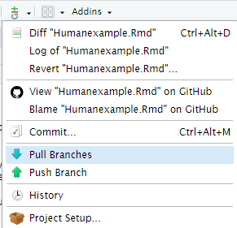

## Setup the Tutorial in the clouds
This steps you can do at the beginning of the tutorial.

### 1. GitHub codespaces


For the tutorial we will use GitHub codespaces as a server.
If you have access to the cluster of your institution, with the conda-package manager installed might want to try to do the tutorial there.


1.  You need a GitHub username.
2.  Go to [github.com/codespaces](https://github.com/codespaces) and log in
3.  Create a new codespaces

   

  - Type `metagenome-atlas/Tryitout` as the name for the repo and select it
  - Use 4 processor machine
  - Create the instance

You have 15 GB storage and 120 core-hours free. (If you are already using codespaces intensely, we might look for another solution.)

This opens a visual studio code environment.

Make sure that the `terminal` is selected in the bottom plane. 

➤ Make it bigger. 


➤ Run `./setup_codespaces.sh` in the terminal

This script installs mamba and sets some conda channels.
If you do it on your cluster have a look at the [documentation](https://metagenome-atlas.readthedocs.io/en/latest/usage/getting_started.html)


### 2. Open the Rstudio server

0. Create a free Rstudio cloud account [here](https://posit.cloud/plans/free).
1. Open this [Rstudio online](https://posit.cloud/content/6178419) environment in a new tab.
2. Click on Git then Pull Branches at the center top of the screen.





<!--


## Setup of the Tutorial on you own computer
#### Setup of Jupyter notebook 

The part of the tutorial works on linux and macOS and maybe on Windows.  You need to install the [conda package manager](https://metagenome-atlas.readthedocs.io/en/latest/usage/getting_started.html#setup). Download this repo with git or download it as [zip archive](https://github.com/metagenome-atlas/Tutorial/archive/master.zip) and extract it.

```
git clone https://github.com/metagenome-atlas/Tutorial.git
cd Tutorial
```

The script use various python package for analyzing and plotting. Set them up by running

```
cd scripts
./setup.sh
```

This creates a conda-environment in order not to interfere with other software on your computer.
Activate the environment by running, then start jupyter:

```
conda activate analyze
jupyter lab
```


Click on the `Differential_abundance.ipynb` and start the differential analysis.

-->