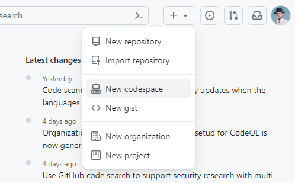
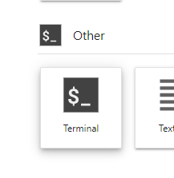

```{r setup, include=FALSE}
library(learnr)
```

## Intro

In the first part of the tutorial, you will

1. learn how to install Atlas
2. init a new project
3. run it.

Everything is done in the command line.

<!--**If you work on Windows don't open this webpage in Microsoft edge, it doesn't display all the interactive part correctly**
-->


## Setup 

### Using GitHub codespaces

0.  You need a GitHub metagenome.
1.  Go to [github.com/codespaces](https://github.com/codespaces) and log in
2.  Create a new codespaces-environment
   {width="6cm"}
  - Use 4 processor machine
  - Create the instance

You have 15GB storage and 120 core-hours free. I hope you are not already using codespaces intensely.

This opens a visual studio code environment. 

Make sure that the `terminal`is selected in the bottom plane. You can make it bigger. 


➤ Run the `setup_codespaces.sh` script in the terminal

<!--

### Setup (binder)

This is an alternative setup, that is simpler but less stable. 

1.  Connect to the server on this [link](https://mybinder.org/v2/gh/metagenome-atlas/Tryitout/main)
2.  Login with the credentials you received before.
3.  At the bottom click on terminal

{width="6cm"}

It is as if you would connect to the server of your institution.
-->


### Conda

The only dependency for metagenome atlas is the *conda package manager*.
It can easily be installed with the miniconda package.

On the server, we have already installed it.


#### Configure conda

To have access to all up-to-date bioinformatics packages you should add tell conda too look for them in the *conda-forge* and the *bioconda* channel in addition to the default.

```{bash eval=F}
conda config --set channel_priority strict

conda config --add channels defaults
conda config --add channels bioconda
conda config --add channels conda-forge
```

These two channels are community-driven efforts to make many software packages installable as easy as possible.

Different programs need often different versions of python/R or other packages.
It can become a nightmare to install different tools with conflicting dependencies.
Conda allows you to encapsulate each software into its own *environment*.

➤ Create an an empty conda environment.

```{bash eval=F}
mamba create --yes -n atlasenv
```

Then activate the environment.

You should see a `(atlasenv)` at the beginning of the bash line.

## Install atlas

Now let's install metagenome-atlas.

```{r setupa, echo=FALSE}
question(
  "How do you install metagenome-atlas? I run the command",
  answer("conda install metagenome-atlas",
    correct = TRUE,
    message = "mamba is a faster alternative to conda, but both work."
  ),
  answer("mamba install metagenome-atlas", correct = TRUE),
  answer("snakemake install metagenome-atlas"),
  type="single"
)
```

➤ Run the fastest command to install metagenome-atlas.

Run `atlas --version`


_Note: The Tutorial was created for version 2.17.1 while it should be no problem for other versions.
There might be minor changes._

## Start a new project

Run `atlas --help`

```{r init1, echo=FALSE}
question(
  "What is the subcommand that you will run to start a new project?",
  answer("atlas download",
    message = "All databases and software is installed on the fly.
    Download is optional."
  ),
  answer("atlas init",
    correct = TRUE,
    message = "Run the command with the '--help' to see what attributes you need"
  ),
  answer("atlas run")
)
```

To start a new project you need the path to the fastq files of your metagenome samples (You analyze all samples together).
We have provided you with two samples of test data in the folder `test_reads`.

The other parameter you should set is the database directory.
This should point to a path where you can store the > 150GB databases and software installed automatically by metagenome-atlas.
Ideally, this is also a shared location with your colleges.
For the Tutorial, we will simply use `databases` folder which already exists.

➤  run the init command:

```{bash, eval=FALSE}
atlas init --db-dir databases --working-dir WD  test_reads
```

Go into the working directory:

```{bash, eval=FALSE}
cd WD
```

```{r init, echo=FALSE}
question(
  "What files did atlas create in the working directory?",
  answer("test_reads"),
  answer("databases", message = "the database folder actually existed before"),
  answer("config.yaml", correct = TRUE),
  answer("atlas"),
  answer("samples.tsv", correct = TRUE)
)
```

## Configure

### The sample table

➤ Have a look at the `samples.tsv` with `cat samples.tsv`.

Check if the names of the samples are inferred correctly.
Samples should be short alphanumeric names starting with a letter.


The `BinGroup` parameter can be used to activate co-binning.
All samples in the same BinGroup are used mapped against each other.

However, as it doesn't make sense to use this feature for less than three samples we don't use it and let the default.

### Modify the config file

Let's check the `config.yaml` file.
Open it in the integrated file browser. (If you are using the binder: Go back to the landing page to open the file.)

It contains many parameters to configure the pipeline.
They are explained in the comments or more in detail in the documentation.

```{r config, echo=FALSE}
message <- "The 'assembly_memory' uses up to 250GB"
question(
  "With the default configuration. How much memory would be used maximally? ",
  answer("250 MB", message = "Memory units are in GB"),
  answer(" 60 GB", message = message),
  answer("250 GB", correct = T),
  answer(" 60 MB", message = message)
)
```

You can also see that this amount of memory would be needed for 48h with 8 CPUs.
When I meant that metagenomics is resource-intensive I was not joking.
Luckily, most institutions have a high-performance computing system with allow you to run such calculations.

For the tutorial we have a small data set witch requires much less resources.


### Set Contaminant references

If you scroll down to `contaminant_references`, you can already see that the Phix genome is added as a contaminant.
The Phix is a virus that is frequently used as a control for sequencing.
Even if you haven't used it in your sequencing there is some chance that some reads might swim around in the sequencer.

Let's add a host genome that should be removed during the decontamination step.
You should find a `host_genome.fasta` in your database folder.


First, move the host genome in the database folder, then add it to the config file in the section `contaminant_references`.


Adapt the contaminant_references as follows:

    contaminant_references:
      PhiX: /path/to/databases/phiX174_virus.fa
      host: /path/to/databases/host_genome.fasta

Don't just copy the snippet above you need to replace `/path/to/` with the correct absolute path.
It's the same for both contaminant references.


Pay attention that there are two spaces at the beginning of the line.

Finally, save the file.


## Running the pipeline

### Dry Run

Before Running the pipeline, which can take more than a day it is always recommended to do a dry-run.
This simulates an execution and checks if there are any errors in the config file or elsewhere.

➤ Run `atlas run --help` to see how to do a dry-run

➤ Call the run command with the dry-run option and `qc` as workflow.

Also specify the working directory.

**In case you missed the dry-run parameter the use `CTR+C` to stop the run.**

The dry-run command takes a while and then it shows a list of all the steps that would be executed.

```{r steps, echo=FALSE}
question(
  "How many steps would be executed by atlas?",
  answer("4"),
  answer("34", correct = TRUE, message = "Remember the number."), # assembly 65
  answer("133", message = "This is for the 'genomes' workflow.")
)
```

This command runs all the steps in the atlas pipeline for two samples.
You can see how it would scale for more samples.

### Resource management

If you run metagenome-atlas on your cluster you should set up a cluster profile, as described in the documentation.
This allows atlas to submit each step to the cluster while specifying the number of cores and memory, not bad!
For more information see the [Documentation.](https://metagenome-atlas.readthedocs.io/en/latest/usage/getting_started.html#execue-atlas)

For the demo, we chose a simpler way and run atlas on a single node.
If you run atlas on a single node you have to tell him not to use too much memory.


➤ Run the following command.

```{bash eval=F}
atlas run qc --max-mem 0.95
```

It limits memory usage to 95% of what is available

### Automatic installation of software

You should see something like:

```{bash, eval=FALSE}
Creating conda environment /usr/local/envs/atlasenv/lib/python3.10/site-packages/atlas/rules/../envs/report.yaml...
Downloading and installing remote packages.
```

In the beginning, atlas installs all the software it needs in conda environments.
This can take quite some time but has to be done only once.

<!--
You can easily run metagenome-atlas on a long running cluster job and come back some hours later.
But wait -- stay here!
For the tutorial, we have already installed all except one conda environment so the

-->

Once the conda environments are installed atlas will start with the steps of the pipeline.

### Stop and go

You might wonder what happens if the server crashes during the long execution of Atlas.

➤ press `CTR + C.`

This simulates a system crash.
The pipeline should stop and do some cleanup.

Now, use ↑ and `Enter` to run the `atlas run qc` command again.
How many steps are now be executed?
Do you see, that metagenome-atlas can continue to run the pipeline form the where it stopped?
There are even checkpoints during the assembly from which it can continue.

## Run the Assembly workflow

➤ If the QC  workflow is not finished. press `CTR + C.` 

➤ And then run the assembly workflow. 


## QC report

While the pipeline is finishing you can already answer the flowing questions?

The `reports/QC_report.html` gives a graphical report on the most important numbers.

The data set used for the Tutorial is a very small one, here you can see the [QC report](https://metagenome-atlas.readthedocs.io/en/latest/_static/QC_report.html) of a bigger run.

<!-- TODO: change reports here -->


```{r qcreport2, echo=FALSE}
message <- "Sample SRS1992976 has very few final reads.
Even more striking is that it started from a high number of initial reads."
question(
  "In the bigger run, are all samples ok? ",
  answer("yes", message = message),
  answer("no", message = message, correct = TRUE)
)
```


### Low quality samples

```{r lowq-sample, echo=FALSE}
message <- "During the contamination and host removal.
Given that the sample comes from a diarrhea patients does this make sense?"
question(
  "During which stage did the sample SRS1992976 lost most of the reads?",
  answer("raw", message = message),
  answer("deduplicated", message = message),
  answer("filtered", message = message),
  answer("qc", message = message, correct = TRUE)
)
```


```{r lowq-sample2, echo=FALSE}
message <- "It depends on your project.
To remove it you can simply drop the line in the sample.tsv.
Note: In the current version of atlas low abundant samples that might give no bin results and stop the pipeline.
In the future it should be easier to exclude samples from binning.
But include it in the quantification."
question(
  "What would you do with the sample?",
  answer("Keep it, but check it at the end?",
    message = message, correct = TRUE
  ),
  answer("Drop it, it doesn't make sense to assemble it?",
    message = message, correct = TRUE
  ),
  type="single"
)
```


### Insert size

The qc report, shows you also the insert size and the read lengths for each sample.
The insert size is the length of the DNA fragment sequenced usually from both ends.


```{r insert-size, echo=FALSE}

question(
  "On average, do the read pairs overlap?",
  answer("no"),
  answer("yes", correct = TRUE),
  answer("sometimes", correct = TRUE),
message = "On average, the insert size is ~225 and the read length ~120.
2x 120 >= 225. So the reads cover the insert size. ", 
type="single"
)
```

```{r insert-size2, echo=FALSE}
message <- "Assembly works fine or even betterwhen there is a gap between the reads."
question(
  "Is this a problem?",
  answer("no", correct = TRUE, message = message),
  answer("yes", message = message)
)
```

_Note: If you have log reads, you can manually add longer k-mer size for the assembly.
See the documentation of the specific assemblers. _
[_Further reading material_](https://www.badgrammargoodsyntax.com/compbio/2018/3/5/compbio-020-reads-fragments-and-inserts-what-you-need-to-know-for-understanding-your-sequencing-data-1)

### QC reads

Once the QC workflow is finished you can look at the sample specific files.

There are also many files produced for each sample.
Once the qc workflow is finished try to find the quality-controlled reads (.fastq) for sample1?

```{r qcfastq, echo=FALSE}
message <- "We have paired-reads.
The third file contains the reads that lost their mate during the quality control.
There should be only a few.
They are used for the mapping to the gene catalog but otherwise are not important."
question(
  "How many qc fastq files are there per sample?",
  answer("1"),
  answer("2"),
  answer("3", correct = TRUE),
  message = message
)
```


## Assembly report

Let's look at the assembly report of the same (larger) dataset. 

TODO: add report.


Are you happy with the fraction of assembled reads?


```{r assreport, echo=FALSE}
message <- "Are you suprised that it's not the sample with the least number or reads?"

wrong_message <- paste("The sample with the least Total BP in figure 1.", message)

question(
  "Which sample has the smalest assembly?",
  answer("SRS1992976, the sample with the leas reads.", message = wrong_message),
  answer("SRS1993058", message = wrong_message),
  answer("SRS1992994", correct = TRUE, message = message),
  answer("SRS1992993", message = wrong_message)
)
```


### N50

N50 is a measure for continuity.

The N50-number characterizes how many contigs do you need to constitute 50% of your assembly (starting from the longest). Hence the lower the better. 

The N50-length is the length of the contig at the 50%- limit. Meaning 50% of your assembly is that long or longer. Hence the larger the better.  

There is some confusion in the field but N50 usually refers to the N50-length.


```{r n50, echo=FALSE}
message <- "Having a high N50-length is a good sign. As it measures the continuity. However the sample in question has one of the smallest assemblies. So other samples that have much larger assemblies even with less continuity contain more contigs for binning. "

question(
  "The sample SRS1992993 has by far the highest N50-length. Is this good or bad?",
  answer("It is good, the sample with the leas reads.", message = message, correct = T),
  answer("It is bad", message = message)
)
```


### N90

N90 is the same as N50 but for 90%. 

```{r n90, echo=FALSE}
message <- "All samples have view large and many small contigs, but for this sample it seems to be extreeme."


question(
  "Surprisingly, the sample with the highest N50 has very low N50 length. What does this mean?",
  answer("It has a very small assembly.", message = message),
  answer("It has a view long contigs and many small ones.", correct = T, message = message),
  answer("It has very high continuity", message = message)
)
```


<!--

https://igv.org/app/

cd WD/sample2/

samtools index sequence_alignment/sample2.bam
samtools faidx sample2_contigs.fasta


import genome,
import track

-->


## Binning


Once the assembly is finished, we try to reconstruct genomes from the metagenome.
This is done by grouping together contigs which we think belong to the same genome.
These groups are called **bins**, and if we really think it is a genome then we call it **MAG for metagenome-assembled genome**


<!--By default, we use the automatic binners metabat2 and maxbin2 and then a bin refining with DAS-Tool.
Both binners are based on the sequence composition and the coverage profile in one sample.
To get the coverage profile we first need to align the reads to the assembly.

-->


## Configure binning

There are many different binner tools. 
Most binners use coverage information and sequence composition to cluster contigs into bins. 
It is even possible to use the coverage information of multiple samples, using `vamb` and or `SemiBin`. This is the recommended binner if you have 20-150 samples. 

Here we will use `metabat` for simplicity. 
To configure this

- Open the config.yaml
- scroll down to the Binning section
- set `final_binner: metabat`
- Also set `filter_chimieric_bins: false` for the tutorial.

## Run the binning workflow

For the binning workflow we exclude one step which uses a lot of of memory.

Run the command

```{bash eval=F}
atlas run binning --max-mem=0.95 --omit-from checkm2_download_db
```

## Binning output

Once the pipeline has finished, let's look at the output.

First, open the contigs file for sample 2 (.fasta file).

```{r nsample, echo=FALSE}
question(
  "What is the name of the first contig? ",
  answer("sample_0"),
  answer("sample2_1"),
  answer("sample2_0",
    correct = TRUE,
    message = "It is also the longest contig in the file."
  )
)
```

Each binner produces a `cluster_attribution.tsv` which provides the link between contig and bin.
Have a look at the one from sample 2 produced by metabat, by running:

```{bash eval=F}
head sample2/binning/metabat/cluster_attribution.tsv
```

```{r qbin1, echo=FALSE}
question(
  "In which bin is the longest contig of sample 2? ",
  answer("sample2_metabat_1", correct = TRUE),
  answer("sample2_metabat_2", message = message),
  answer("No clue.", message = "the longest contig as stated above is 'sample2_0'")
)
```


<!--
### Bin refining

The DAS Tool takes the predictions of both binners and tries to find a harmonization with the best result, meaning the highest quality.

Have a look at the the : `sample2/binning/DASTool/sample2_DASTool.log`

Do you see how DASTool treats the bin `sample2_metabat_1`?
Which bin from maxbin is in competition with this bin?

-->


### Quality assessment

Usually the pipeline would continue and asses the genome completeness and contamination using CheckM2.
Unfortunately, this step cannot be run as it requires the download of a database.

## Investigate the bins

Let's have a look at some of the genomes.

➤  Go to  `WD/sample2/binning/metabat/bins`

➤  With the `atlasenv` activated, run `sendsketch.sh protein <binf.asta>`

`sendsketch.sh` is a tool from the BBMap package. It predicts proteins from the genome, creates a signature of these proteins and sends them to a server where it is matched against all genomes from NCBI.

The resulting table shows you its hits. 

AAI or Amino acid identity, shows the similarity, `Compl` and `Contam` gives an estimation of completeness and contamination for this genome.
Not bad!?


<!--
But, you can look [here](https://rawcdn.githack.com/metagenome-atlas/Tutorial/31f89f0bdf476ab34b7e52ebd68ef14e20b9c677/media/bin_report_DASTool.html) at the final output of the binning report.


```{r qbin6, echo=FALSE}
question(
  "How many different species are there in both samples? ",
  answer("2"),
  answer("3", correct = TRUE, message = ),
  answer("5", message = "some genomes from sample 1 and 2 belong to the same species")
)
```

-->
The *genomes* sub-workflow of Atlas combines the binning results from different samples and produces a non-redundant set of MAGs.
The workflow also quantifies the genomes in all the samples and annotates them with a better taxonomy.

## End

Because of the computational and time limits we won't run atlas until the end.
It won't any way not be very interesting for this small dataset.
Instead, you will analyze the output of a more interesting project in part 2 of the Tutorial.

You can no go [Part 2 of the Tutorial](https://metagenome-atlas.shinyapps.io/Part2).
On the flowing pages are some extra exercises about the atlas gene-catalog workflow.

## Extra

### Gene catalog

```{bash eval=F}
atlas run genecatalog --max-mem 0.95 -omit-from gene_subsets
```

Have a look at the output of the gene catalog workflow.

```{bash,eval=FALSE}
head Genecatalog/gene_catalog.faa
```

Count how many genes are there, by counting the fasta headers.

```{bash,eval=FALSE}
grep -c '^>' Genecatalog/gene_catalog.faa
```
